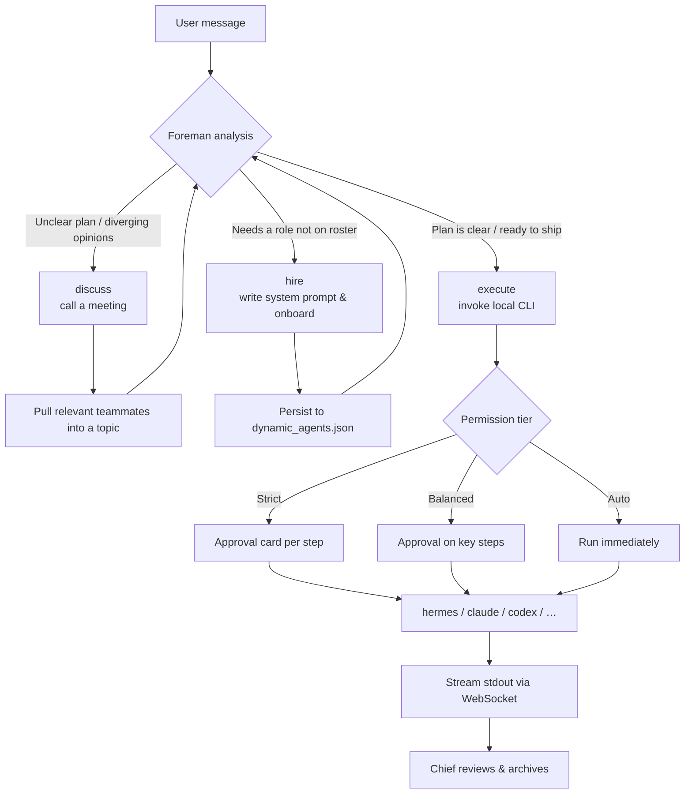

# Crew · Desktop-native Multi-Agent Workspace

[简体中文](./README.md) · **English**

> A desktop-native multi-agent workspace you launch with a double-click.
> One **Foreman** + one **Chief** + eleven functional teammates
> run the full loop of *discuss → hire → dispatch → execute → review*
> inside a single native window.
> Powered by a local FastAPI + WebSocket backend, rendered in
> Microsoft Edge WebView2, and able to delegate real execution to any
> locally-installed **Hermes / Claude Code / OpenAI Codex / OpenCode /
> Aider / Gemini CLI**.

<p align="left">
  
  
  
  
  
  
  <a href="https://github.com/IFConstantine/crew-multi-agent/releases/latest"></a>
</p>

---

## 📖 Table of Contents

- [Positioning](#-positioning)
- [Features](#-features)
- [Tech Stack](#-tech-stack)
- [Architecture](#-architecture)
- [Quick Start](#-quick-start)
- [Team Roster](#-team-roster)
- [Workflow: How Foreman Dispatches](#-workflow-how-foreman-dispatches)
- [Supported LLM Providers](#-supported-llm-providers)
- [Supported Local Agent CLIs](#-supported-local-agent-clis)
- [Permission Model](#-permission-model)
- [Repository Layout](#-repository-layout)
- [Where Data Lives](#-where-data-lives)
- [Building From Source](#-building-from-source)
- [Development Guide](#-development-guide)
- [FAQ](#-faq)
- [Roadmap](#-roadmap)
- [License](#-license)

---

## 🎯 Positioning

**Crew is not a "multi-role chatbot toy". It's a desktop workspace that turns LLMs into a real productivity surface.**

It addresses three concrete pain points:

1. **A single agent is not enough.** Real work spans product, engineering, design, QA, legal, finance — a generic "assistant" can't cover that.
2. **Existing multi-agent frameworks stay in the CLI.** LangGraph, CrewAI, AutoGen — great libraries, but they gate the experience behind engineering skill. End users can't touch them directly.
3. **Web UIs are a compromise.** Browser tabs, address bars, bookmarks are all noise. A serious workspace deserves its own window, icon, and taskbar presence.

Crew's positioning:

- **Product angle:** a Windows desktop app you can ship to non-engineers — double-click and go.
- **Engineering angle:** an open-source scaffold where you can customize agents, swap LLM providers, and bridge to any local CLI.
- **Interaction angle:** the mental model is *"handing tasks to a team"*, not *"chatting with a bot"*.

---

## ✨ Features

### Native desktop experience

- **One double-click, straight into the app window.** No black CMD console, no browser chrome.
- Built on [pywebview](https://pywebview.flowrl.com/) + the Windows-built-in **Edge WebView2**. Installer is only ~20 MB.
- Close the window = exit the process. No background residue.
- Proper application icon, taskbar entry, Start-menu shortcut, and Control Panel uninstall entry — behaves like a real desktop app.

### Multi-agent collaboration

- **11 permanent teammates** + **1 Foreman** + **1 Chief** = 13 agents total
- Each teammate has their own **avatar, function, tone, and system prompt**
- Foreman has three verbs: `discuss` (call a meeting), `hire` (dynamically onboard a new teammate), `execute` (invoke a real local CLI)
- **Dynamic hiring:** when a task exceeds the current roster, Foreman writes a new system prompt and adds them to `dynamic_agents.json` — persisted across restarts.

### LLM provider abstraction

- **10 providers, one-click switching:** OpenAI · Anthropic · DeepSeek · Kimi · Zhipu GLM · VolcEngine ARK · OpenRouter · Groq · Qwen · SiliconFlow
- **Smart key-prefix detection:** paste `sk-ant-*` → instantly Anthropic, paste `sk-or-*` → instantly OpenRouter. When the prefix is ambiguous, the wizard drops a picker.
- Supports both **OpenAI-compatible** and **Anthropic Messages** protocols
- Change provider / model / key any time from the settings panel — no restart needed.

### Auto-detected local Agent CLIs ⭐

- **Not locked into any single executor** — Foreman can delegate to whichever local coding agent you have installed.
- On startup, Crew detects: Hermes, Claude Code, OpenAI Codex, OpenCode, Aider, Gemini CLI.
- Switch the default executor from the settings panel. Uninstalled ones are greyed out.
- Add a new CLI in a single dict entry in `agents_cli.py`.

### Real execution

- When Foreman decides to actually *do the thing*, it shells out to the currently selected CLI: `hermes -z --yolo` / `claude -p` / `codex exec` / `opencode run` / `aider --yes` / `gemini -p`
- Three permission tiers: **Strict** (approve every step) / **Balanced** (default) / **Auto** (Foreman decides)
- Full audit chain: Foreman intent → approval card in UI → user approve/reject → logged to `team.db`

### Local-first

- All writable data lives under `%APPDATA%\Crew\`: `config.json` / `.env` / `team.db` (SQLite) / `dynamic_agents.json`
- **Nothing exposed externally** — the app binds only to `127.0.0.1:8765`. LAN access is deliberately disabled.
- Uninstall keeps your data. Reinstall picks up where you left off.

---

## 🧰 Tech Stack

| Layer | Technology | Role |
|---|---|---|
| **Packaging** | PyInstaller 6.21 (onedir) | Python + deps + static assets → standalone `crew.exe` |
| **Installer** | Inno Setup 6 | Produces `Crew-Setup-*.exe` (standard Windows installer + uninstall entry) |
| **Desktop shell** | pywebview 6.2 + Edge WebView2 | Native window, main-thread GUI |
| **Backend** | FastAPI 0.115 + Uvicorn | HTTP + WebSocket dual channels |
| **Model calls** | httpx (async) | OpenAI-compatible + Anthropic Messages, both protocols |
| **Storage** | SQLite (stdlib `sqlite3`) | Topics / messages / approvals |
| **Frontend** | Vanilla HTML + CSS + JS, no framework | Lightweight, fast startup, easy to audit |
| **Chinese font** | LXGW WenKai (web-loaded) | Sans-serif Kai style |
| **CLI bridge** | subprocess → any detected local Agent CLI | Unified abstraction in `agents_cli.py` |

**Why not Electron?** Electron ships Chromium on every install (~150 MB). WebView2 reuses the system Edge runtime — 20 MB installer, <2s cold start.

**Why no frontend framework?** The whole UI is one window with a message stream. React/Vue's build pipeline, state library, and bundle size would be negative value here. Plain HTML served by FastAPI's `StaticFiles` — save file, hit reload, done.

---

## 🏗 Architecture

```
┌────────────────────────────────────────────────────────────────┐
│                Double-click crew.exe (Windows GUI subsystem)     │
│                              │                                  │
│                launcher.py (main process, single PID)            │
│              ┌─────────────┼─────────────┐                     │
│              │             │             │                     │
│         [main thread]  [daemon thread]                          │
│              │             │                                    │
│      pywebview.create   uvicorn.run                             │
│         Edge WebView2   FastAPI @ 127.0.0.1:8765                │
│         native window     │                                     │
│              ↕            │                                     │
│         HTTP + WS ────────┤                                     │
│                           │                                     │
│                    ┌──────┴──────┐                              │
│                    │  server.py  │                              │
│                    │  (API tier) │                              │
│                    └──────┬──────┘                              │
│                           │                                     │
│           ┌───────────────┼──────────────┐                      │
│           ↓               ↓              ↓                      │
│    supervisor.py    providers.py    static/index.html          │
│  (Foreman logic)   (10 LLM plumbing)  (frontend SPA)            │
│           │                                                     │
│           ↓                                                     │
│    agents_cli.py (local CLI abstraction + auto-detect)          │
│           │                                                     │
│           └─→ subprocess → hermes / claude / codex /            │
│                            opencode / aider / gemini            │
│                                                                 │
│  Data on disk:  %APPDATA%\Crew\                                 │
│    ├─ config.json          # prefs + provider + selected CLI    │
│    ├─ .env                 # API keys (never pushed to GitHub)   │
│    ├─ team.db              # SQLite: topics / msgs / approvals   │
│    ├─ dynamic_agents.json  # runtime-hired teammates             │
│    └─ launcher.log         # boot log                            │
└────────────────────────────────────────────────────────────────┘
```

### Key design constraints

- **pywebview must run on the main thread** (Windows COM requirement). uvicorn goes into a daemon thread, so exiting the process is total.
- **`console=False` (Windows GUI subsystem)** — no CMD window flashes on launch. Side effect: `sys.stdout = None`, so every `print` goes through `_redirect_std_streams` and gets swallowed into a log file.
- **ASSETS_DIR vs. DATA_DIR:** read-only assets live inside the exe (PyInstaller `_MEIPASS`); writable data lives under `%APPDATA%`. Uninstall/reinstall keeps history.
- **Port 8765 is hardcoded.** Multi-instance would require dynamic port allocation.

---

## 🚀 Quick Start

### Option 1 — Installer (recommended)

1. Grab the latest **`Crew-Setup-vX.X.X.exe`** (~20 MB) from the [Releases page](https://github.com/IFConstantine/crew-multi-agent/releases/latest)
2. Double-click it, walk through the wizard (optional desktop / Start-menu shortcuts)
3. Launch from the desktop or Start menu
4. First run pops the onboarding wizard — paste any provider's API key. Crew auto-detects the provider from the prefix.

**Uninstall:** Control Panel → Programs and Features → Crew → Uninstall. Your data stays at `%APPDATA%\Crew\`; delete it manually if you want a clean wipe.

### Option 2 — Portable

1. Grab **`Crew-vX.X-win64.zip`** (~22 MB)
2. Extract anywhere
3. Double-click `crew.exe`

No admin rights, no registry writes.

### Option 3 — From source

For development, debugging, or hacking on internals.

```bash
# 1. Clone
git clone https://github.com/IFConstantine/crew-multi-agent.git
cd crew-multi-agent

# 2. Virtual env (Python 3.11+, 3.13 recommended)
python -m venv .venv
.venv\Scripts\activate

# 3. Install deps
pip install fastapi "uvicorn[standard]" httpx websockets pywebview pillow

# 4. Desktop mode (native window)
python launcher.py

# Or web-only mode (open http://127.0.0.1:8765/ in your browser)
python server.py
```

**Requires Windows 10 / 11.** Older Windows 10 builds may lack the WebView2 Runtime — grab the Evergreen build from [Microsoft](https://developer.microsoft.com/en-us/microsoft-edge/webview2/).

---

## 👥 Team Roster

| Role | Name | Purpose | When they appear |
|---|---|---|---|
| Chief | **Chief** | Decision-making, sign-off, retrospection | Strategy calls, final approval |
| Foreman | **Foreman** | Dispatch, hiring, execution | **Always present** — receives every incoming task |
| Product | **Pine** | PRDs, requirements, prioritization | Fuzzy needs, scope creep |
| Engineering | **Ash** | Architecture, code, tech choices | Implementation, debugging, perf |
| Design | **Wren** | UI/UX, visuals, interaction | UI, ergonomics, usability |
| QA | **Owl** | Test cases, regression, verification | Pre-release, bug repro |
| Data | **Rune** | Metrics, tracking, analysis | Data-driven decisions, A/B outcomes |
| Support | **Poppy** | User feedback, FAQs | User complaints, post-sales |
| Legal | **Judge** | Compliance, terms, privacy | User data, contracts |
| Ops / Growth | **Rally** | Growth, campaigns, content | Acquisition, community, conversion |
| HR | **Ivy** | Hiring, team, collaboration | Personnel, team growth |
| Finance | **Ledger** | Budget, cost, reporting | Budget approval, cost analysis |

**Each teammate's system prompt** lives in the `AGENTS` dict in `supervisor.py` — personality, tone, capability boundaries, tool preferences.

**Dynamic hiring:** if a task needs "a game designer" or "a molecular biology expert", Foreman writes a fresh system prompt and appends to `dynamic_agents.json` for future sessions.

---

## 🔄 Workflow: How Foreman Dispatches

**User sends a message → Foreman decides → one of three verbs:**



**Approval card in the UI:**

```
┌────────────────────────────────────────────────┐
│ Foreman wants to execute (Claude Code):         │
│   Command: claude -p "Write a Python script..." │
│   Estimated: 30s                                 │
│                                                 │
│   [Approve]   [Reject]   [Details]              │
└────────────────────────────────────────────────┘
```

---

## 🔌 Supported LLM Providers

### Cloud APIs (10 providers)

| Provider | Default model | Key prefix detection | Protocol |
|---|---|---|---|
| **VolcEngine ARK** | `ark-code-latest` | Manual only | OpenAI-compatible |
| **OpenAI** | `gpt-4o-mini` | `sk-` (shared) | OpenAI native |
| **Anthropic Claude** | `claude-3-5-sonnet-latest` | ✅ `sk-ant-` unique | Anthropic Messages |
| **DeepSeek** | `deepseek-chat` | `sk-` (shared) | OpenAI-compatible |
| **Kimi** (Moonshot) | `kimi-latest` | `sk-` (shared) | OpenAI-compatible |
| **Zhipu GLM** | `glm-4-flash` | ✅ `hex.hex` unique | OpenAI-compatible |
| **OpenRouter** | `anthropic/claude-3.5-sonnet` | ✅ `sk-or-` unique | OpenAI-compatible |
| **Groq** | `llama-3.3-70b-versatile` | ✅ `gsk_` unique | OpenAI-compatible |
| **Qwen** (Alibaba) | `qwen-plus` | `sk-` (shared) | OpenAI-compatible |
| **SiliconFlow** | `Qwen/Qwen2.5-7B-Instruct` | `sk-` (shared) | OpenAI-compatible |

### Local / self-hosted deployments (v1.5+)

| Provider | Default port | Default endpoint | API key required |
|---|---|---|---|
| **Ollama** | `11434` | `http://127.0.0.1:11434/v1/chat/completions` | ✗ optional |
| **LM Studio** | `1234` | `http://127.0.0.1:1234/v1/chat/completions` | ✗ optional |
| **vLLM / TGI / llama.cpp server** | `8000` | `http://127.0.0.1:8000/v1/chat/completions` | ✗ optional |
| **Custom OpenAI-compatible endpoint** | user-defined | `http://127.0.0.1:8000/v1/chat/completions` | ✗ optional |

**Typical local-deployment recipes:**

- **Ollama**: `ollama pull llama3.2` → `ollama serve` → in Crew pick Ollama, set model to `llama3.2`.
- **LM Studio**: download a model in the GUI → Server tab → Start Server → pick LM Studio, use the identifier shown in the panel.
- **vLLM**: `python -m vllm.entrypoints.openai.api_server --model Qwen/Qwen2.5-7B-Instruct` → pick vLLM.
- **Corporate LLM gateway**: pick "Custom OpenAI-compatible endpoint" and drop in your own URL + model name.

**Detection strategy:** prefer prefix uniqueness. When a prefix is ambiguous (the four `sk-` sharing providers), the wizard drops a picker for the user. Local deployments bypass key detection entirely.

**Adding your own provider:** append one entry to the `PROVIDERS` dict in `providers.py` — five lines.

---

## 🤖 Supported Local Agent CLIs

Crew is **not tied to any single executor**. On startup, `agents_cli.py` probes the system PATH (and a few well-known install locations) for these:

### Built-in

| Agent | Command | Invocation | Notes |
|---|---|---|---|
| **Hermes Agent** | `hermes` | `hermes -z "<prompt>" --yolo` | Nous Research's general-purpose agent framework |
| **Claude Code** | `claude` | `claude -p "<prompt>"` | Anthropic's official CLI |
| **OpenAI Codex** | `codex` | `codex exec "<prompt>"` | OpenAI's official coding agent |
| **OpenCode** | `opencode` | `opencode run "<prompt>"` | Open-source community fork |
| **Aider** | `aider` | `aider --message "<prompt>" --yes --no-git` | Long-running git-aware pair programmer |
| **Gemini CLI** | `gemini` | `gemini -p "<prompt>"` | Google's official CLI |

### Auto-detection

At startup, `agents_cli.py` does the following for each spec (`BUILTIN_SPECS` + user-defined `custom_agents` from config):

1. If `command` is an absolute path, test `Path.exists()` directly
2. Otherwise, calls `shutil.which()` to look up the command on PATH
3. Falls back to a few well-known "installed to a fixed spot" locations (e.g. `%APPDATA%\npm\` for npm-installed CLIs, Hermes' venv path)
4. Returns a list of `{id, name, path, installed, custom, homepage, install_hint, args_template}`

**Default pick:** Hermes if installed, otherwise the first installed agent in order. Once the user picks explicitly in the settings panel, the choice is persisted to `config.json` under `local_agent`.

### Manual switching

Top-right settings panel → **本地执行 Agent · Local Executor** dropdown. Uninstalled agents are greyed out, custom agents show a `(自定义)` tag. Install or add one, restart the app, and it'll show up.

### Custom agents (v1.5+)

Beyond the six built-ins, Crew lets you register **arbitrary local agents** — your in-house tools, forks of open-source projects, home-grown agents, whatever.

**How to add:** ⚙ settings → Local Executor → **+ 添加 (Add)**

Fill five fields:

| Field | Description | Example |
|---|---|---|
| **ID** | Unique id (must not collide with built-in ids) | `my-agent` |
| **Display name** | Text shown in the dropdown | `My Custom Agent` |
| **Command** | Absolute path or PATH command name | `C:\Tools\myagent.exe` or `myagent` |
| **Args template** | Use `{prompt}` as placeholder; without it, the prompt is auto-appended | `run --input {prompt} --yolo` |
| **Homepage** | Optional | — |

**Storage:** written to `config.json` under `custom_agents`:

```json
{
  "custom_agents": [
    {
      "id": "my-agent",
      "name": "My Custom Agent",
      "command": "C:\\Tools\\myagent.exe",
      "args_template": "run --input {prompt} --yolo",
      "homepage": ""
    }
  ]
}
```

**REST API** for programmatic management:

- `GET  /api/custom-agents` — list all custom agents
- `POST /api/custom-agents` — add or update (upsert by id)
- `DELETE /api/custom-agents/<id>` — remove one

### Adding a new built-in CLI

Append one entry to `BUILTIN_SPECS` in `agents_cli.py`:

```python
AgentSpec(
    id="your-agent",
    name="Your Agent",
    command="your-agent",           # command name (no extension)
    build_args=lambda prompt: ["--prompt", prompt, "--non-interactive"],
    homepage="https://your-agent.example",
    install_hint="npm install -g @your-org/your-agent",
    extra_probe_paths=[             # optional: non-PATH install locations
        str(Path.home() / "AppData" / "Local" / "your-agent" / "bin" / "your-agent.exe"),
    ],
),
```

Restart, done.

### API endpoints

- `GET /api/local-agents` → detection results + currently selected
- `POST /api/local-agents/select` `{"agent_id": "claude"}` → switch default executor
- `GET  /api/custom-agents` → user-defined agents
- `POST /api/custom-agents` → upsert one
- `DELETE /api/custom-agents/<id>` → remove
- `GET /api/config` also carries `local_agents` / `selected_local_agent` / `local_agent_ready`

---

## 🔐 Permission Model

Three graduated tiers:

| Tier | Foreman behavior | Fits when |
|---|---|---|
| **Strict** | Approval card on every `discuss` / `hire` / `execute` | First-time use, production data, unfamiliar CLI behavior |
| **Balanced** (default) | `discuss` auto-passes; `hire` / `execute` need approval | Day-to-day |
| **Auto** | Everything auto-passes, Foreman is fully autonomous | Long batch runs, AFK operation |

Stored in `%APPDATA%\Crew\config.json` under `permission_level`. Change from the dropdown at the top of the main UI.

---

## 📁 Repository Layout

```
crew-multi-agent/
├─ launcher.py              # Entry: pywebview window + uvicorn thread
├─ server.py                # FastAPI app + routes + WebSocket broadcast
├─ supervisor.py            # Foreman brain + 11 agent definitions
├─ providers.py             # 10-provider LLM abstraction + auto-detect
├─ agents_cli.py            # Local CLI abstraction + probe (Hermes/Claude/Codex/…)
├─ gen_icon.py              # Emits static/crew.ico (7-size multi-frame)
├─ gen_avatars.py           # Emits static/avatars/*.svg (DiceBear frozen)
│
├─ crew.spec                # PyInstaller spec
├─ crew.iss                 # Inno Setup script
├─ install.py / install.bat # First-time source install wizard (optional)
│
├─ static/                  # Frontend assets (baked into exe, read-only)
│  ├─ index.html            # Single-file SPA (HTML + CSS + JS)
│  ├─ crew.ico              # App icon (7 sizes)
│  ├─ crew.png              # 256×256 preview
│  └─ avatars/*.svg         # 12 teammate avatars
│
├─ dist_extras/             # Redistribution extras
│  └─ README.md             # User-facing README bundled in packages
│
├─ 打开作战室.bat            # Source-mode launcher (Windows)
├─ 停止作战室.bat            # Kill-all crew.exe helper
├─ start_hidden.vbs         # Windowless start (for startup folder)
│
├─ .env.example             # API key template
├─ .gitignore
├─ README.md                # Chinese
├─ README.en.md             # You are here
└─ LICENSE
```

---

## 💾 Where Data Lives

**All writable data lives under `%APPDATA%\Crew\`** (i.e. `C:\Users\<you>\AppData\Roaming\Crew\`):

| File | Purpose | Kept after uninstall? |
|---|---|---|
| `config.json` | Preferences (provider, model, permission tier, selected local agent, onboarding state) | Yes |
| `.env` | API keys (plaintext) | Yes |
| `team.db` | SQLite: topics, messages, approval log | Yes |
| `dynamic_agents.json` | System prompts of Foreman-hired teammates | Yes |
| `launcher.log` | Boot log | Yes |
| `server.log` | Backend log | Yes |
| `launcher_crash.log` | Crash traceback (if any) | Yes |

**Why keep them?** Uninstall + reinstall preserves history. To wipe: `rmdir /s "%APPDATA%\Crew"`.

---

## 📦 Building From Source

### Toolchain

```bash
pip install pyinstaller
```

Plus [Inno Setup 6](https://jrsoftware.org/isdl.php) (free, default location is fine).

### Three steps

```bash
# 1. Generate the icon (optional — repo already ships static/crew.ico)
python gen_icon.py

# 2. PyInstaller → crew.exe + dependency directory
pyinstaller crew.spec --noconfirm --clean
# → dist/Crew/crew.exe (~10 MB)
# → dist/Crew/_internal/ (~25 MB — Python runtime + all .pyd)

# 3. Inno Setup → installer
"C:/Users/<you>/AppData/Local/Programs/Inno Setup 6/ISCC.exe" crew.iss
# → dist/Crew-Setup-vX.X.X.exe (~20 MB)
```

### Build gotchas

- **Use `onedir`, not `onefile`** — 3–5× faster startup, plays nicely with installer diffs.
- **`console=False`** — Windows GUI subsystem; no CMD flash.
- **Must `collect_all('pydantic_core')`** — pydantic v2's C extension `.pyd` can't be found via hidden import alone.
- **Must `collect_all('webview')` / `clr_loader` / `pythonnet`** — pywebview leans on the .NET bridge on Windows.
- **Icon embed:** `exe = EXE(..., icon="static/crew.ico")` in `crew.spec`. Verify with `pefile`: the built `crew.exe` should carry 7 `RT_ICON` entries.

---

## 🛠 Development Guide

### Adding a teammate

Add an entry to `AGENTS` in `supervisor.py`:

```python
AGENTS = {
    ...
    "Sage": {
        "role_zh": "顾问",
        "avatar": "static/avatars/Sage.svg",
        "system_prompt": (
            "You are Sage, a seasoned strategy advisor. Calm tone, tight logic, "
            "always structure your point in three bullets. Keep replies under 200 words."
        ),
        "temperature": 0.6,
    },
}
```

Drop a `static/avatars/Sage.svg` (pull from [DiceBear](https://www.dicebear.com/9.x/pixel-art/svg?seed=Sage)), restart.

### Adding an LLM provider

Add an entry to `PROVIDERS` in `providers.py` — see the [Supported LLM Providers](#-supported-llm-providers) section for the schema.

### Adding a local Agent CLI

Add an entry to `AGENT_SPECS` in `agents_cli.py` — see the [Supported Local Agent CLIs](#-supported-local-agent-clis) section.

### Modifying the UI

`static/index.html` is a **single-file SPA** — HTML, CSS, and JS all in one file. No build step.

Save, `Ctrl+R` in the app window, done. No backend restart needed.

### Debug mode

In `launcher.py`, flip `webview.start(gui=None, debug=False)` to `debug=True`. Right-click in the window → "Inspect" opens DevTools.

Backend logs: source mode goes to stdout; packaged builds go to `%APPDATA%\Crew\launcher.log`.

---

## ❓ FAQ

**Q: Windows Defender says "unknown publisher".**
A: Expected. The installer isn't code-signed (individual EV cert ~$300/yr, deferred). Click "More info → Run anyway". A proper EV cert is the only real fix.

**Q: Double-clicking the icon does nothing.**
A: Check `%APPDATA%\Crew\launcher.log` and `launcher_crash.log`. Most common cause: missing WebView2 Runtime on older Windows 10 — install the Evergreen build from Microsoft.

**Q: Can I access this from the LAN?**
A: Not by default — `launcher.py` binds to `127.0.0.1`. You can flip it to `0.0.0.0` and add your own auth layer, but exposing this to the internet is a **bad idea**.

**Q: macOS / Linux?**
A: **Windows only today.** pywebview supports WKWebView (macOS) and GTK WebKit (Linux) in principle, but the icon, installer, and data-path code all need adapting. PRs welcome.

**Q: What if I have zero local Agent CLIs installed?**
A: Fine. `discuss` and `hire` don't touch any local CLI. Only `execute` needs one — and if none is present, you'll get an "no executor installed" message with install commands for each supported option.

**Q: 20 MB installer, but 35 MB after unpacking. Why?**
A: Inno Setup uses LZMA2 compression. The unpacked size includes Python 3.13 runtime (~15 MB) + pydantic_core `.pyd` (~2 MB) + WebView2 bridge DLLs (~5 MB) + FastAPI/uvicorn/httpx (~3 MB).

**Q: Can I use just one LLM provider?**
A: Yes. Paste one key in the wizard, ignore the rest. Change / add later from the settings panel.

---

## 🗺 Roadmap

- [x] v1.0 — Web prototype (local browser)
- [x] v1.1 — 10-provider LLM abstraction + auto-detect
- [x] v1.2 — pywebview desktop window, no CMD flash
- [x] v1.3 — Custom icon + Inno Setup installer
- [x] v1.4 — **Multi-CLI support** (Hermes / Claude Code / Codex / OpenCode / Aider / Gemini auto-detect + switch)
- [ ] v1.5 — Tray icon + background residence (close-to-tray)
- [ ] v1.6 — Multi-session / multi-project workspaces
- [ ] v1.7 — Export & share (dump a `discuss` to Markdown / PDF)
- [ ] v1.8 — macOS build (pywebview + WKWebView)
- [ ] v2.0 — Plugin system (third-parties can register new agents / providers / executors)

---

## 📄 License

[MIT](./LICENSE)

---

## 🙏 Acknowledgements

- Desktop shell: [pywebview](https://pywebview.flowrl.com/)
- Backend: [FastAPI](https://fastapi.tiangolo.com/) · [Uvicorn](https://www.uvicorn.org/)
- Packaging: [PyInstaller](https://pyinstaller.org/) · [Inno Setup](https://jrsoftware.org/isinfo.php)
- Chinese font: [LXGW WenKai](https://github.com/lxgw/LxgwWenKai)
- Avatars: [DiceBear](https://www.dicebear.com/) pixel-art style
- Local CLI ecosystem: Hermes · Claude Code · OpenAI Codex · OpenCode · Aider · Gemini CLI
- LLM APIs: VolcEngine ARK · OpenAI · Anthropic · DeepSeek · Moonshot · Zhipu · OpenRouter · Groq · Qwen · SiliconFlow

---

<sub>Built by <a href="https://github.com/IFConstantine">IFConstantine</a> · <a href="./README.md">简体中文</a></sub>
