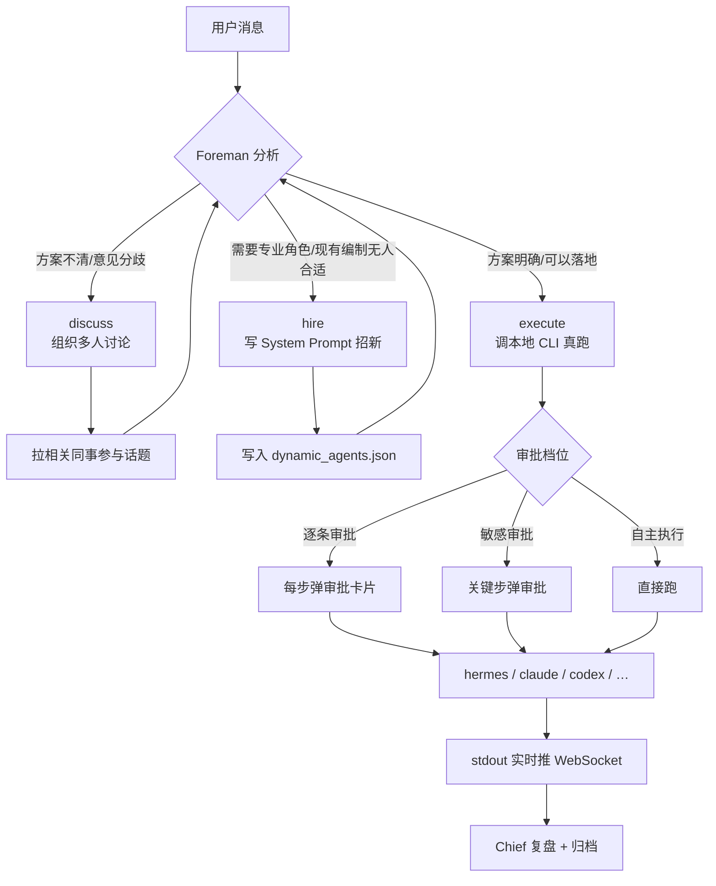

# Crew · 桌面级多 Agent 协作运行时

**简体中文** · [English](./README.en.md)

> **一个把多 Agent 编排、多 LLM 抽象、多本地 CLI 桥接整合为单一桌面运行时的开源工程。**
> 前端由 pywebview + WebView2 呈现原生窗口，后端为 FastAPI + WebSocket 双通道，
> 内建 12 位领域 Agent（+ 用户可无限扩展），支持 14 家 LLM Provider（云端 10 家 + 本地/私有 4 家），
> 执行层可无缝桥接 **Hermes / Claude Code / OpenAI Codex / OpenCode / Aider / Gemini CLI** 或任意用户自定义 CLI。

<p align="left">
  
  
  
  
  
  
  
  <a href="https://github.com/V-lVl/crew-multi-agent/releases/latest"></a>
</p>

---

## 📖 目录

- [项目定位](#-项目定位)
- [功能特性](#-功能特性)
- [技术栈](#-技术栈)
- [系统架构](#-系统架构)
- [快速开始](#-快速开始)
- [Agent 团队编制](#-agent-团队编制)
- [工作流：Foreman 如何调度](#-工作流foreman-如何调度)
- [支持的 LLM Provider](#-支持的-llm-provider)
- [支持的本地 Agent CLI](#-支持的本地-agent-cli)
- [用户自定义能力（v1.5+）](#-用户自定义能力v15)
- [权限模型](#-权限模型)
- [目录结构](#-目录结构)
- [数据存储位置](#-数据存储位置)
- [自行打包](#-自行打包)
- [开发指南](#-开发指南)
- [常见问题](#-常见问题)
- [路线图](#-路线图)
- [License](#-license)

---

## 🎯 项目定位

**Crew 定位为一款「Agent-native 桌面工作台」**——不是聊天机器人，而是一个可编程、可扩展、可分发的多 Agent 运行时。

它面向三类真实的工程 gap：

1. **单 Agent 覆盖不了多域协作**——生产任务通常横跨产品、开发、测试、法务、财务多个角色；单一 LLM prompt 无法沉淀专业上下文。Crew 用**多 Agent 编排 + 领域 System Prompt**把每个角色独立成有身份、有职能、有语气的 Actor。
2. **既有多 Agent 框架工程门槛高**——LangGraph / CrewAI / AutoGen 是 SDK 库，交付物是"你自己写代码去跑"，无法直接分发给非工程用户。Crew 提供**编译好的桌面二进制** + 首次运行向导 + 图形化配置，覆盖到零代码用户。
3. **执行层长期与推理层强耦合**——用户想让不同 Agent 去调不同的本地工具（Claude Code 写代码、Codex 跑测试、自建 CLI 处理内部数据），需要一个**开放的适配层**。Crew 在 `agents_cli.py` 里把执行器抽象成 `AgentSpec`，运行时探测 + 手动切换 + 用户自定义 CLI 全部覆盖。

### 三个视角看 Crew

| 视角 | 描述 |
|---|---|
| **产品** | Windows `.exe` 双击即用；20 MB 安装包；无终端窗口；有独立进程图标、任务栏入口、开始菜单、控制面板卸载项 |
| **工程** | Python 3.11+ + FastAPI + WebSocket + SQLite + pywebview + WebView2，纯前端 HTML/JS 无框架，全栈可 hack |
| **运行时** | 多 LLM Provider 抽象（OpenAI-compat / Anthropic Messages / 本地 OpenAI-compat）+ 多 CLI 执行器抽象（subprocess + args template）+ 三档审批权限 + 持久化会话 |

---

## ✨ 功能特性

### 桌面原生集成

- **无终端窗口**：`crew.exe` 的 PE Subsystem = 2（Windows GUI），启动即进入 WebView2 窗口，无 CMD 黑框
- **原生外壳**：pywebview 6.2 主进程 + Edge WebView2 内核，冷启动 < 2 秒
- **完整桌面契约**：独立进程图标（RT_ICON 7 尺寸）+ 任务栏条目 + 开始菜单快捷方式 + Programs & Features 卸载入口
- **发行体积** ≈ 20 MB（Setup EXE）/ ≈ 22 MB（便携 ZIP）——对比同类 Electron 应用 150 MB+

### 多 Agent 编排

- **12 位内置 Agent**：Foreman（任务调度）+ Chief（决策者）+ 10 位领域同事（产品、开发、设计、测试、数据、客服、法务、运营、HR、财务）
- **每位 Agent 独立可配置**：`name / role / emoji / color / system prompt / default_on`（默认是否在场）
- **v1.6+：用户完全自主创建 Agent** ⭐——图形面板填 6 字段即注册新同事，无需通过 Foreman 招募
- Foreman 三种动作：`discuss`（组织多 Agent 讨论）· `hire`（Foreman 主动补编）· `execute`（真调本地 CLI 落地任务）
- **动态招募 + 用户创建的角色**统一存 `dynamic_agents.json`，重启后立即在场

### LLM Provider 抽象层

- **14 家 provider**：OpenAI · Anthropic · DeepSeek · Kimi · 智谱 GLM · 火山方舟 · OpenRouter · Groq · 通义千问 · SiliconFlow · **Ollama** · **LM Studio** · **vLLM/TGI/llama.cpp server** · **自定义 OpenAI 兼容 endpoint**
- **协议**：OpenAI Chat Completions（12 家）+ Anthropic Messages（1 家）+ 本地部署 OpenAI-compat（4 家共用协议）
- **API Key 前缀智能识别**：粘 `sk-ant-*` → Anthropic；`sk-or-*` → OpenRouter；`gsk_*` → Groq；共享 `sk-*` 前缀时弹下拉手选
- **本地部署 Key 可选**（`key_optional=True`）——Ollama / LM Studio / vLLM 一般不校验 key，UI 上主动提示"可留空"
- **Endpoint 完全可覆盖**：默认走 provider 出厂 URL，用户填自己的 endpoint（局域网 IP / 反向代理 / 公司内部 gateway）即可
- **v1.6+：连通性自测按钮** ⭐——填完 endpoint 一键测调用，直接返回 `latency_ms` + 模型响应，无需先保存再发消息试

### 本地 Agent CLI 抽象层 ⭐

- **执行器解耦**：Foreman 不 hardcode 任何单一 CLI，全部走 `agents_cli.AgentSpec` 抽象
- **6 家内置**：Hermes · Claude Code · OpenAI Codex · OpenCode · Aider · Gemini CLI
- **启动时自动探测**：`shutil.which()` + 兜底 npm 全局路径 + venv 位置
- **v1.6+：用户自定义 CLI + 现场试跑按钮** ⭐——图形面板填 5 字段（id / name / command / args_template / homepage）注册任意本地 agent；单条目"试跑"按钮直接拿 `Say hello in one line` 打一次，实时看 stdout + 延迟
- **参数模板系统**：`args_template` 支持 `{prompt}` 占位符；缺占位符时 prompt 自动追加到末尾
- **绝对路径 / PATH 命令名**都支持——`C:\Tools\myagent.exe` 与 `myagent`（走 PATH 查找）等价

### 落地执行 + 三档权限

- Foreman `execute` 时通过 `asyncio.create_subprocess_exec` 起子进程调用当前选中 CLI
- stdout / stderr 按行流回前端，实时渲染到消息流
- 三档审批：**逐条审批**（每步确认）· **敏感审批**（默认，敏感操作确认）· **自主执行**（Foreman 全权）
- 完整审批链：Foreman 意图 → 前端弹卡片 → 用户点批准/驳回 → 记录到 `team.db`

### 本地优先 + 数据主权

- 全部数据存 `%APPDATA%\Crew\`：`config.json`（配置）· `.env`（API key）· `team.db`（SQLite 消息 + 审批）· `dynamic_agents.json`（自定义同事）
- **对外零监听**：`uvicorn` 只绑 `127.0.0.1:8765`，局域网访问需显式改代码
- **卸载不删数据**，重装恢复现场（Inno Setup 的 `UsePreviousData=yes`）

---

## 🧰 技术栈

| 层 | 技术 | 用途 |
|---|---|---|
| **打包** | PyInstaller 6.21（onedir 模式） | 把 Python + 依赖 + 静态资源 → 独立 `crew.exe` |
| **安装器** | Inno Setup 6 | 生成 `Crew-Setup-*.exe`（Windows 标准安装向导 + 卸载入口） |
| **桌面壳** | pywebview 6.2 + Edge WebView2 | 原生窗口，主线程 GUI |
| **后端** | FastAPI 0.115 + Uvicorn | HTTP + WebSocket 双通道 |
| **模型调用** | httpx（异步） | OpenAI 兼容 + Anthropic Messages 双协议 |
| **数据** | SQLite (stdlib `sqlite3`) | 话题 / 消息 / 审批记录 |
| **前端** | 原生 HTML + CSS + JS，无框架 | 保持轻量、启动快、易审计 |
| **中文字体** | LXGW WenKai（Web 加载） | 无衬线楷体 |
| **CLI 桥接** | subprocess → 探测到的任意本地 Agent CLI | 统一在 `agents_cli.py` 抽象 |

**为什么不用 Electron？** Electron 每次都要打包整个 Chromium（~150 MB）；WebView2 用系统已有的 Edge 内核，安装包 20 MB 就能跑，冷启动 < 2 秒。

**为什么不用前端框架？** 项目 UI 就一个窗口 + 一个消息流，React/Vue 的构建链、状态库、打包体积在这个场景是负资产。原生 HTML 直接由 FastAPI 的 `StaticFiles` 挂载，一处改动秒热更。

---

## 🏗 系统架构

```
┌────────────────────────────────────────────────────────────────┐
│                    双击 crew.exe（Windows GUI 程序）              │
│                              │                                  │
│                launcher.py（主进程，PID 唯一）                    │
│              ┌─────────────┼─────────────┐                     │
│              │             │             │                     │
│         [主线程]      [守护子线程]                                │
│              │             │                                    │
│      pywebview.create   uvicorn.run                             │
│         Edge WebView2   FastAPI @ 127.0.0.1:8765                │
│         原生窗口          │                                       │
│              ↕            │                                     │
│         HTTP + WS ────────┤                                     │
│                           │                                     │
│                    ┌──────┴──────┐                              │
│                    │   server.py │                              │
│                    │   (API 层)  │                              │
│                    └──────┬──────┘                              │
│                           │                                     │
│           ┌───────────────┼──────────────┐                      │
│           ↓               ↓              ↓                      │
│    supervisor.py    providers.py    static/index.html          │
│    (Foreman 决策)   (10 家 LLM)     (前端 SPA)                   │
│           │                                                     │
│           ↓                                                     │
│    agents_cli.py（本地 CLI 抽象 + 自动探测）                       │
│           │                                                     │
│           └─→ subprocess → hermes / claude / codex /            │
│                            opencode / aider / gemini            │
│                                                                 │
│  数据落盘：%APPDATA%\Crew\                                       │
│    ├─ config.json          # 用户偏好 + provider + 选中 CLI       │
│    ├─ .env                 # API key（本地明文存放）                │
│    ├─ team.db              # SQLite: 话题/消息/审批                │
│    ├─ dynamic_agents.json  # Foreman 动态招入的同事               │
│    └─ launcher.log         # 启动日志                             │
└────────────────────────────────────────────────────────────────┘
```

### 关键设计约束

- **pywebview 必须跑主线程**（Windows COM 要求），因此 uvicorn 走守护子线程，进程退出即整体退出
- **console=False（Windows GUI subsystem）**，双击不弹 CMD 黑窗；副作用是 `sys.stdout = None`，所有 `print` 走 `_redirect_std_streams` 兜底到日志文件
- **ASSETS_DIR / DATA_DIR 分离**：只读静态资源打进 exe（PyInstaller `_MEIPASS`），可写数据走 `%APPDATA%`，卸载重装不丢历史
- **端口 8765 硬编码**：应用只对本机通信，多开需要改端口分配逻辑

---

## 🚀 快速开始

### 方式一：安装器（推荐）

1. 从 [Releases 页](https://github.com/V-lVl/crew-multi-agent/releases/latest) 下载最新版 **`Crew-Setup-vX.X.X.exe`**（≈20 MB）
2. 双击运行，走安装向导（可选桌面/开始菜单快捷方式）
3. 完成 → 从桌面或开始菜单启动 Crew
4. 首次运行会弹向导：粘贴任一家 LLM 的 API key → 系统自动识别 provider → 点"好的，开始"

**卸载**：控制面板 → 程序和功能 → 找到 "Crew" → 卸载。用户数据默认保留在 `%APPDATA%\Crew\`，如需彻底清除手动删除该目录。

### 方式二：便携版

1. 下载 **`Crew-vX.X-win64.zip`**（≈22 MB）
2. 解压到任意目录
3. 双击 `crew.exe`

无需管理员权限、无需写注册表，绿色便携。

### 方式三：源码运行

适合开发、调试、自行修改。

```bash
# 1. 克隆
git clone https://github.com/V-lVl/crew-multi-agent.git
cd crew-multi-agent

# 2. 建虚拟环境（Python 3.11+，推荐 3.13）
python -m venv .venv
.venv\Scripts\activate

# 3. 装依赖
pip install fastapi "uvicorn[standard]" httpx websockets pywebview pillow

# 4. 跑桌面版（原生窗口）
python launcher.py

# 或跑纯 Web 版（浏览器访问 http://127.0.0.1:8765/）
python server.py
```

**前置**：需要 Windows 10/11。Windows 10 早期版本可能缺 WebView2 Runtime，从 [Microsoft 官网](https://developer.microsoft.com/en-us/microsoft-edge/webview2/) 下载 Evergreen 版本即可。

---

## 👥 Agent 团队编制

| 角色 | 英文名 | 定位 | 何时出场 |
|---|---|---|---|
| 老板 | **Chief** | 决策/拍板/复盘 | 战略级问题、验收 |
| 任务调度 | **Foreman** | 调度/招人/落地执行 | **总是在场**，接收所有任务 |
| 产品 | **Pine** | 需求梳理、PRD、优先级 | 需求不清、方案发散 |
| 开发 | **Ash** | 架构、代码、技术选型 | 实现、调试、性能优化 |
| 设计 | **Wren** | UI/UX、视觉、交互 | 界面、体验、可用性问题 |
| 测试 | **Owl** | 用例、回归、QA | 上线前、Bug 复现 |
| 数据 | **Rune** | 指标、埋点、分析 | 决策要看数、AB 结果 |
| 客服 | **Poppy** | 用户反馈、FAQ | 用户抱怨、售后 |
| 法务 | **Judge** | 合规、条款、隐私 | 涉及用户数据、条款 |
| 运营 | **Rally** | 增长、活动、内容 | 拉新、社区、转化 |
| HR | **Ivy** | 招聘、团建、协作 | 人事、扩编 |
| 财务 | **Ledger** | 预算、成本、报表 | 预算审批、财务分析 |

**每位同事的 System Prompt 定义在 `supervisor.py` 的 `AGENTS` 字典中**，包含：性格、语气、专业能力边界、常用工具偏好。

**动态招新**：如果任务需要一位"游戏策划""生物学专家"，Foreman 会生成一份新 System Prompt 加入 `dynamic_agents.json`，下次自动加载。

---

## 🔄 工作流：Foreman 如何调度

**用户发一条消息 → Foreman 做决策 → 三种动作之一**：



**审批卡片长这样**（前端渲染）：

```
┌────────────────────────────────────────────────┐
│ Foreman 要执行（Claude Code）：                  │
│   命令：claude -p "写个 Python 脚本…"            │
│   预计耗时：30 秒                                 │
│                                                 │
│   [批准]   [驳回]   [看详情]                      │
└────────────────────────────────────────────────┘
```

---

## 🔌 支持的 LLM Provider

### 云端 API（10 家）

| Provider | 默认模型 | API 前缀识别 | 协议 |
|---|---|---|---|
| **火山方舟** (VolcEngine ARK) | `ark-code-latest` | 手选 | OpenAI 兼容 |
| **OpenAI** | `gpt-4o-mini` | `sk-` (共用) | OpenAI 原生 |
| **Anthropic Claude** | `claude-3-5-sonnet-latest` | ✅ `sk-ant-` 唯一 | Anthropic Messages |
| **DeepSeek** | `deepseek-chat` | `sk-` (共用) | OpenAI 兼容 |
| **Kimi** (月之暗面) | `kimi-latest` | `sk-` (共用) | OpenAI 兼容 |
| **智谱 GLM** | `glm-4-flash` | ✅ `hex.hex` 唯一 | OpenAI 兼容 |
| **OpenRouter** | `anthropic/claude-3.5-sonnet` | ✅ `sk-or-` 唯一 | OpenAI 兼容 |
| **Groq** | `llama-3.3-70b-versatile` | ✅ `gsk_` 唯一 | OpenAI 兼容 |
| **通义千问** (阿里) | `qwen-plus` | `sk-` (共用) | OpenAI 兼容 |
| **SiliconFlow** (硅基流动) | `Qwen/Qwen2.5-7B-Instruct` | `sk-` (共用) | OpenAI 兼容 |

### 本地/私有部署（v1.5+）

| Provider | 默认端口 | 默认 endpoint | Key 是否必需 |
|---|---|---|---|
| **Ollama** | `11434` | `http://127.0.0.1:11434/v1/chat/completions` | ✗ 可选 |
| **LM Studio** | `1234` | `http://127.0.0.1:1234/v1/chat/completions` | ✗ 可选 |
| **vLLM / TGI / llama.cpp server** | `8000` | `http://127.0.0.1:8000/v1/chat/completions` | ✗ 可选 |
| **自定义 OpenAI 兼容 endpoint** | 用户填 | `http://127.0.0.1:8000/v1/chat/completions` | ✗ 可选 |

**本地部署常见玩法：**

- **Ollama**：`ollama pull llama3.2` → `ollama serve` → Crew 里选 Ollama、model 填 `llama3.2` 即用
- **LM Studio**：GUI 下载模型 → Server 页 → Start Server → 选 LM Studio → model 用它面板上显示的 identifier
- **vLLM**：`python -m vllm.entrypoints.openai.api_server --model Qwen/Qwen2.5-7B-Instruct` → 选 vLLM 即用
- **公司内部 LLM 网关**：选自定义 OpenAI 兼容 endpoint，填自己的 URL 和 model 名

**识别策略**：优先看 key 前缀能否唯一定位；共用 `sk-` 前缀的四家（OpenAI/DeepSeek/Kimi/通义）识别不了时，向导会弹下拉让用户手动选择。本地部署不看 key 前缀。

**加自己的 provider**：编辑 `providers.py` 中的 `PROVIDERS` 字典即可，5 行代码搞定。

---

## 🤖 支持的本地 Agent CLI

Crew **不绑定单一执行器**——Foreman 可以调用系统里任意一款已装的本地 coding agent。启动时自动探测，用户可在设置面板里切换。

### 内置支持

| Agent | 命令 | 调用格式 | 说明 |
|---|---|---|---|
| **Hermes Agent** | `hermes` | `hermes -z "<prompt>" --yolo` | Nous Research 的通用 agent 框架 |
| **Claude Code** | `claude` | `claude -p "<prompt>"` | Anthropic 官方 CLI |
| **OpenAI Codex** | `codex` | `codex exec "<prompt>"` | OpenAI 官方 coding agent |
| **OpenCode** | `opencode` | `opencode run "<prompt>"` | 开源社区 fork |
| **Aider** | `aider` | `aider --message "<prompt>" --yes --no-git` | 老牌 git-aware pair programmer |
| **Gemini CLI** | `gemini` | `gemini -p "<prompt>"` | Google 官方 |

### 自动探测

启动时 `agents_cli.py` 会：

1. 遍历 `BUILTIN_SPECS` 列表 + 用户在 UI 里配置的 `custom_agents`
2. 对每一项调 `shutil.which()` 查系统 PATH；命令是绝对路径的直接测 `exists()`
3. 兜底看几个常见"绿色安装"路径（如 `%APPDATA%\npm\` 下的 `.cmd` 快捷方式、Hermes 的 venv 位置）
4. 返回一个 `[{id, name, path, installed, custom, homepage, install_hint, args_template}]` 列表

**优先级**：默认选 Hermes；Hermes 没装就按顺序找第一个装了的。用户在设置面板选过一次后，会记到 `config.json` 的 `local_agent` 字段。

### 手动切换

主界面右上角设置面板 → **本地执行 Agent · Local Executor** 下拉。未安装的项灰掉不可选，自定义的显示 `(自定义)` 标签，安装/添加完重启应用会自动出现在列表里。

### 自定义 Agent（v1.5+）

除了内置 6 家，Crew 允许用户添加**任意本地 agent**——自建 agent、公司内部工具、开源项目 fork 都行。

**添加方式**：⚙ 设置面板 → 本地执行 Agent → **+ 添加**

填 5 个字段：

| 字段 | 说明 | 例子 |
|---|---|---|
| **ID** | 唯一标识（不能撞内置 id） | `my-agent` |
| **显示名** | 下拉里的显示文本 | `My Custom Agent` |
| **命令** | 绝对路径或 PATH 命令名 | `C:\Tools\myagent.exe` 或 `myagent` |
| **参数模板** | 用 `{prompt}` 占位；不含则 prompt 自动追加末尾 | `run --input {prompt} --yolo` |
| **官网** | 可选 | — |

**存储**：写到 `config.json` 的 `custom_agents` 数组：

```json
{
  "custom_agents": [
    {
      "id": "my-agent",
      "name": "My Custom Agent",
      "command": "C:\\Tools\\myagent.exe",
      "args_template": "run --input {prompt} --yolo",
      "homepage": ""
    }
  ]
}
```

**API 接口**：也可直接用 REST 管理

- `GET  /api/custom-agents` — 列出所有自定义 agent
- `POST /api/custom-agents` — 新增或更新一个（upsert by id）
- `DELETE /api/custom-agents/<id>` — 删除一个

### 加一个内置 CLI

编辑 `agents_cli.py` 的 `AGENT_SPECS` 列表，追加一条 `AgentSpec`：

```python
AgentSpec(
    id="your-agent",
    name="Your Agent",
    command="your-agent",           # 系统 PATH 里的可执行文件名（不含扩展）
    build_args=lambda prompt: ["--prompt", prompt, "--non-interactive"],
    homepage="https://your-agent.example",
    install_hint="npm install -g @your-org/your-agent",
    extra_probe_paths=[             # 可选：非标准安装位置的兜底路径
        str(Path.home() / "AppData" / "Local" / "your-agent" / "bin" / "your-agent.exe"),
    ],
),
```

重启即生效。

### API 端点

- `GET /api/local-agents` → 探测结果 + 当前选中
- `POST /api/local-agents/select` `{"agent_id": "claude"}` → 切换默认执行器
- `GET /api/config` 里的 `local_agents` / `selected_local_agent` / `local_agent_ready` 字段同样反映探测状态

---

## 🧩 用户自定义能力（v1.5+）

Crew 从 v1.5 起把"扩展"下放到普通用户，无需改代码。三条独立通道：

### 1. 自定义 LLM Endpoint

任何 OpenAI Chat Completions 兼容的服务都可以接进来：Ollama、LM Studio、vLLM、TGI、llama.cpp server、公司内部 LLM gateway、反向代理、Cloudflare AI Gateway……

**UI 路径**：右上角 ⚙ → Provider 下拉选 **Ollama / LM Studio / vLLM / 自定义 OpenAI 兼容 endpoint** → Endpoint 输入框改成你自己的地址 → Model 填模型名 → API Key 留空（或填内网 token）→ 保存

**连通性自测（v1.6+）**：Endpoint 输入框下方有 **"连通性测一下"** 按钮，配置未保存前先发一次 `{role: user, content: ping}` 请求，返回延迟 + 模型 reply。失败时展示完整错误信息（HTTP 状态码 + body），排错不用去翻日志。

**API：**

```bash
# 试跑当前 UI 上填的配置（不保存）
curl -X POST http://127.0.0.1:8765/api/providers/test \
  -H "Content-Type: application/json" \
  -d '{"provider":"ollama","endpoint":"http://127.0.0.1:11434/v1/chat/completions","model":"llama3.2"}'
# {"ok":true,"latency_ms":432,"model_reply":"pong","provider":"ollama",...}
```

### 2. 自定义本地 Agent CLI

除内置 6 家外，可注册任意 CLI 执行器。

**UI 路径**：⚙ 设置 → 本地执行 Agent 下方 **"+ 添加"** → 5 字段：

| 字段 | 说明 | 例 |
|---|---|---|
| `id` | 唯一标识（禁撞内置） | `my-agent` |
| `name` | 显示名 | `My Custom Agent` |
| `command` | 绝对路径或 PATH 命令 | `C:\Tools\myagent.exe` |
| `args_template` | 参数模板，`{prompt}` 为占位符 | `run --input {prompt} --yolo` |
| `homepage` | 可选 | — |

**试跑（v1.6+）**：每条自定义 agent 行有 **"试跑"** 按钮，发一个 `Say hello in one line.` 到该 CLI，超时 45 秒。UI 里实时显示延迟 + stdout 前 120 字。写完立刻验证，不用打开真话题去测。

**存储**：写入 `config.json.custom_agents` 数组。运行时 `agents_cli.detect_installed()` 合并内置 + 自定义。

**REST API：**

```
GET    /api/custom-agents            列出所有
POST   /api/custom-agents            upsert 一条 (by id)
DELETE /api/custom-agents/<id>       删除一条
POST   /api/local-agents/test        试跑
POST   /api/local-agents/select      设为默认
```

### 3. 自定义同事（v1.6+）⭐

之前只有 Foreman 才能"招人"（`hire` action，运行时才能触发）。**v1.6 把这条能力开放到用户，通过图形面板直接创建**——用户即"HR"。

**UI 路径**：右上角 **👥 同事管理** 按钮 → **+ 创建新同事** → 6 字段：

| 字段 | 说明 |
|---|---|
| `name` | 英文名，唯一，不能撞内置（如 Vera / Nova / Milo） |
| `role` | 职能标签（如"架构师"、"DBA"、"安全工程师"） |
| `emoji` | 头像字符（如 ⚙ ✦ ▲ ♢） |
| `color` | 头像底色（原生 color picker） |
| `system` | 完整 System Prompt（可 markdown，含职责、风格、边界） |
| `default_on` | 是否新话题默认在场（不勾则要用户 @ 或让 Foreman 招入） |

**存储**：写入 `dynamic_agents.json`，内存里同步进 `AGENTS` 字典 → 路由器 (`router_system`)、多人讨论 (`discuss`)、招募 (`hire`) 全部立即可见。

**编辑 & 删除**：同一面板可编辑现有自定义同事的 role/emoji/color/system，或整个删除。内置 12 位不可删。

**REST API：**

```
GET    /api/agents/custom            列出 {custom: [...], builtin: [...]}
POST   /api/agents/custom            upsert (by name)
DELETE /api/agents/custom/<name>     删除
```

**内置 name 保护**：POST 时若 `name ∈ 内置 12 位`（Foreman/Pine/Ash/Wren/Owl/Chief/Rune/Poppy/Judge/Rally/Ivy/Ledger），返回 400。

---

## 🔧 MCP · Model Context Protocol（v2.0+）

从 v2.0 起，agent 可以**调用工具**——读文件、抓网页、执行命令、查时间等。基于 Anthropic 提出的 MCP 协议标准，可对接任何遵循协议的外部 server。

### 开箱 4 个内置 Server（Python，零外部依赖）

| Server | 默认 | 用途 |
|---|---|---|
| **time** | ✅ 开 | 当前时间 + 时区转换 |
| **fetch** | ✅ 开 | HTTP GET 抓 URL 文本 |
| **filesystem** | ⚙️ 关 | 沙箱内文件读写（沙箱路径 `%APPDATA%\Crew\workspace`） |
| **shell** | ⚙️ 关 | 白名单命令执行（`ls`/`git`/`curl`/… 只读命令） |

后两个默认关闭是出于安全考虑，用户在 🔧 面板一键启用。

### 三层安全设计

1. **协议层**：`subprocess exec + list argv`，不走 shell，天然免疫命令注入
2. **沙箱层**：filesystem 有 root 目录限制，路径逃逸被拦；shell 有命令白名单
3. **权限层**：per-agent × per-tool，用 glob 精细控制（如 `Owl` 只能 `filesystem.read_file`）

### Prompt-based Tool Calling

不依赖 provider 的 native function calling —— 用 fenced code block 协议：

```
用户: 现在北京几点？

Ash: ```tool_call
     {"tool": "time.now", "args": {"tz": "Asia/Shanghai"}}
     ```

系统: [tool_result] time.now ✓ 2026-07-15 14:42:55 CST

Ash: 当前北京时间是 14:42:55。
```

**优点**：14 家 provider 全兼容（包括本地 Ollama 小模型），不受 Anthropic/OpenAI tool schema 差异折磨。

### 前端体验

- **🔧 MCP 面板**：一键开关 server、看 tools、编辑 agent 权限
- **消息流卡片**：`TOOL CALL #1 · Ash → time.now` / `RESULT · 2026-07-15 14:42:55`——用户全程可见 agent 在调啥、拿到啥

### 自愈 + 循环上限

- Server 挂了下次调用**自动重启**，不用手动救
- 单次会话 tool call 上限 **5 次**，防止 LLM 无限循环烧 token

### 扩展外部 Server

任何 MCP 协议的 server 都能接。编辑 `%APPDATA%\Crew\mcp_servers.json`：

```json
{
  "servers": [
    {
      "name": "github",
      "enabled": true,
      "command": "npx",
      "args": ["-y", "@modelcontextprotocol/server-github"],
      "env": {"GITHUB_TOKEN": "ghp_..."}
    }
  ]
}
```

社区 server 列表见 [modelcontextprotocol.io/servers](https://modelcontextprotocol.io/servers)。

---

## 🛡️ 运行时保障（v1.7+）

从 v1.7 起，运行时能力从"能跑"升级到"生产可用"：

### 上下文与成本

- **自动上下文裁剪**：滑动窗口 + 元数据感知（每个 provider 记录 `max_context`），系统 prompt + 最新消息优先保留，中段插入 `[...省略 N 条...]` 标记
- **Token & Cost tracking**：每次 LLM 调用记录 `prompt_tokens / completion_tokens / cost_usd`，按 agent 拆分。顶栏 💰 徽章每 30 秒刷新今日花费
- **单价表**：14 家 provider 的输入/输出单价内置在 `pricing.py`，本地模型（Ollama / LM Studio / vLLM / TGI）按 $0 计
- **失败重试**：429 / 5xx / 网络错走指数退避（1s → 2s → 4s，最多 3 次）

### 交互控制

- **⏹ 停止**：正在生成的所有 agent 消息一键中断（cancel 后台 asyncio task）
- **🔄 重来**：hover 到任意 agent 消息头部出现，最后一条可重新生成
- **📎 附件**：图片（GPT-4o / Claude 3.5+ / Doubao Vision / Qwen-VL 自动识别多模态）+ 文本文件（.md/.txt/.py/.json 拼进 prompt）；支持点击、拖拽、`Ctrl+V` 粘贴
- **WS 自动重连**：断线时指数退避重连（1s → 30s），恢复后自动补消息

### 权限

- **Per-agent 权限档位**：默认沿用全局；单独把 Owl 设 `strict` 时，即使全局 `autonomous`，Owl 的执行仍然要审批。**"就高不就低"**——全局与 agent 谁更严格取谁

### 数据

- **附件持久化**：`%APPDATA%\Crew\attachments\{sha1}.{ext}`，去重存储
- **使用日志**：`team.db` 的 `llm_usage` 表，可导出做成本分析

---


## 🔐 权限模型

三档递进：

| 档位 | Foreman 行为 | 适合场景 |
|---|---|---|
| **逐条审批** | 每一次 `discuss` / `hire` / `execute` 都弹审批卡片 | 首次使用、涉及生产数据、不熟悉本地 Agent 行为 |
| **敏感审批**（默认） | `discuss` 自动通过；`hire` / `execute` 弹审批 | 日常使用 |
| **自主执行** | 全部自动通过，Foreman 全权处理 | 长时间批处理、离席运行 |

档位存储在 `%APPDATA%\Crew\config.json` 的 `permission_level` 字段（值仍为 `strict` / `balanced` / `autonomous`），主界面顶部下拉框实时切换。

---

## 📁 目录结构

```
crew-multi-agent/
├─ launcher.py              # 入口：pywebview 窗口 + uvicorn 子线程
├─ server.py                # FastAPI 应用 + 路由 + WebSocket 广播
├─ supervisor.py            # Foreman 大脑 + 11 位 Agent 定义
├─ providers.py             # 10 家 LLM 抽象 + 自动识别
├─ agents_cli.py            # 本地 Agent CLI 抽象 + 探测（Hermes/Claude/Codex/…）
├─ gen_icon.py              # 生成 static/crew.ico（7 尺寸多帧）
├─ gen_avatars.py           # 生成 static/avatars/*.svg（DiceBear 固化）
│
├─ crew.spec                # PyInstaller 打包脚本
├─ crew.iss                 # Inno Setup 安装器脚本
├─ install.py / install.bat # 首次源码安装向导（可选）
│
├─ static/                  # 前端资源（打进 exe 只读）
│  ├─ index.html            # 单文件 SPA（HTML+CSS+JS）
│  ├─ crew.ico              # 应用图标（7 尺寸）
│  ├─ crew.png              # 256×256 预览
│  └─ avatars/*.svg         # 12 个 Agent 头像
│
├─ dist_extras/             # 分发用附加文件
│  └─ README.md             # 打包后用户看的说明
│
├─ 打开作战室.bat            # 源码模式快捷启动（Windows）
├─ 停止作战室.bat            # 关闭所有 crew.exe
├─ start_hidden.vbs         # 无窗口启动（可放启动项）
│
├─ .env.example             # API key 示例
├─ .gitignore
├─ README.md                # 你正在读的这份（中文）
├─ README.en.md             # 英文版
└─ LICENSE
```

---

## 💾 数据存储位置

**所有可写数据都在 `%APPDATA%\Crew\`**（即 `C:\Users\<你>\AppData\Roaming\Crew\`）：

| 文件 | 用途 | 卸载后 |
|---|---|---|
| `config.json` | 用户偏好（provider、model、权限档、选中的本地 Agent、onboard 状态） | 保留 |
| `.env` | API key（明文） | 保留 |
| `team.db` | SQLite：话题、消息、审批记录 | 保留 |
| `dynamic_agents.json` | Foreman 动态招入的同事 System Prompt | 保留 |
| `launcher.log` | 启动日志 | 保留 |
| `server.log` | 后端日志 | 保留 |
| `launcher_crash.log` | 崩溃堆栈（如有） | 保留 |

**为什么保留？** 卸载重装不丢历史。想彻底清除：`rmdir /s "%APPDATA%\Crew"`。

---

## 📦 自行打包

### 依赖工具

```bash
pip install pyinstaller
```

外加 [Inno Setup 6](https://jrsoftware.org/isdl.php)（免费，装到默认位置即可）。

### 三步走

```bash
# 1. 生成图标（可选，仓库已带 static/crew.ico）
python gen_icon.py

# 2. PyInstaller 出 crew.exe + 依赖目录
pyinstaller crew.spec --noconfirm --clean
# → dist/Crew/crew.exe (≈10 MB)
# → dist/Crew/_internal/ (≈25 MB, 含 Python runtime + 所有 .pyd)

# 3. Inno Setup 出安装器
"C:/Users/<你>/AppData/Local/Programs/Inno Setup 6/ISCC.exe" crew.iss
# → dist/Crew-Setup-vX.X.X.exe (≈20 MB)
```

### 打包关键点

- **PyInstaller 用 `onedir` 不用 `onefile`**：启动快 3-5 倍，便于 Inno Setup 增量更新
- **`console=False`**：Windows GUI subsystem，双击不弹 CMD
- **必须 `collect_all('pydantic_core')`**：pydantic v2 的 C 扩展 `.pyd` 靠 hidden import 抓不到
- **必须 `collect_all('webview')` `collect_all('clr_loader')` `collect_all('pythonnet')`**：pywebview 依赖 .NET 绑定
- **图标嵌入**：`crew.spec` 里 `exe = EXE(..., icon="static/crew.ico")`，通过 `pefile` 可以验证 exe 里有 7 个 `RT_ICON` 资源

---

## 🛠 开发指南

### 加一位新 Agent

编辑 `supervisor.py` 中 `AGENTS` 字典：

```python
AGENTS = {
    ...
    "Sage": {
        "role_zh": "顾问",
        "avatar": "static/avatars/Sage.svg",
        "system_prompt": (
            "你叫 Sage，一位资深战略顾问。语气沉稳、逻辑严密、"
            "习惯用 3 点式结论表达观点。回答控制在 200 字以内。"
        ),
        "temperature": 0.6,
    },
}
```

放一个 `static/avatars/Sage.svg`（去 [DiceBear](https://www.dicebear.com/9.x/pixel-art/svg?seed=Sage) 拉即可），重启即生效。

### 加一家 LLM Provider

编辑 `providers.py` 中 `PROVIDERS` 字典，见 [支持的 LLM Provider](#-支持的-llm-provider) 一节的样例。

### 加一款本地 Agent CLI

编辑 `agents_cli.py` 的 `AGENT_SPECS` 列表，见 [支持的本地 Agent CLI](#-支持的本地-agent-cli) 一节的样例。

### 修改 UI

`static/index.html` 是**单文件 SPA**（HTML+CSS+JS 全在里面，无构建步骤）。

改完保存 → 桌面窗口按 `Ctrl+R`（或右键 → 重新加载）即可看到效果，无需重启后端。

### 调试模式

`launcher.py` 里把 `webview.start(gui=None, debug=False)` 的 `debug` 改成 `True`，桌面窗口右键会出现"检查"选项（DevTools）。

后端日志：源码模式默认打 stdout；打包版默认写到 `%APPDATA%\Crew\launcher.log`。

---

## ❓ 常见问题

**Q：Windows Defender 弹"未知发行者"警告？**
A：正常。安装包未做代码签名（个人开发者证书 ¥3000/年，暂缓）。点"更多信息 → 仍要运行"即可。想彻底消除警告需要购买 EV 代码签名证书。

**Q：双击图标没反应？**
A：查看 `%APPDATA%\Crew\launcher.log` 和 `launcher_crash.log`。最常见原因是 WebView2 Runtime 缺失（Win 10 老版本），从微软官网下载安装 Evergreen 版即可。

**Q：能局域网访问吗？**
A：默认不能，`launcher.py` 里 `host="127.0.0.1"`。改成 `"0.0.0.0"` 并加上你自己的鉴权层后可以，但**不建议**直接暴露到公网。

**Q：能跑在 macOS / Linux 吗？**
A：**当前只支持 Windows**。pywebview 在 macOS 用 WKWebView、Linux 用 GTK WebKit 理论上都能跑，但没测过，图标 / 安装器 / 数据路径都需要适配。欢迎 PR。

**Q：一个本地 Agent CLI 都没装，能跑吗？**
A：能。所有 discuss / hire 流程完全不依赖本地 CLI；只有当 Foreman 决定 `execute` 时才会去调。此时会返回一段"未装 Agent"的提示 + 各家安装命令。

**Q：安装包是 20 MB，为什么解压后有 35 MB？**
A：Inno Setup 用 LZMA2 压缩，解压后是原始文件。其中 `_internal/` 里主要是 Python 3.13 runtime（≈15 MB）+ pydantic_core `.pyd`（≈2 MB）+ WebView2 桥接 DLL（≈5 MB）+ FastAPI/uvicorn/httpx（≈3 MB）。

**Q：可以只用一家 LLM 吗？**
A：可以。向导里填一家的 key 即可，其他家不用管。后续想加只需右上角设置 → 切换 provider → 填新 key。

---

## 🗺 路线图

- [x] v1.0 - Web 版原型（本地浏览器）
- [x] v1.1 - 10 家 LLM 抽象 + 自动识别
- [x] v1.2 - pywebview 桌面窗口 + 无黑窗
- [x] v1.3 - 自研图标 + Inno Setup 安装器
- [x] v1.4 - **多本地 Agent CLI 支持**（Hermes / Claude Code / Codex / OpenCode / Aider / Gemini 自动探测与切换）
- [ ] v1.5 - **托盘图标 + 后台常驻**（关窗最小化到托盘）
- [ ] v1.6 - **多会话/多项目**（同时开多个 workspace）
- [ ] v1.7 - **导出/分享**（把一次 discuss 导成 Markdown/PDF）
- [ ] v1.8 - **macOS 版本**（pywebview + WKWebView）
- [ ] v2.0 - **插件系统**（第三方可注册新 Agent、新 Provider、新执行器）

---

## 📄 License

[MIT](./LICENSE)

---

## 🙏 致谢

- 桌面壳：[pywebview](https://pywebview.flowrl.com/)
- 后端：[FastAPI](https://fastapi.tiangolo.com/) · [Uvicorn](https://www.uvicorn.org/)
- 打包：[PyInstaller](https://pyinstaller.org/) · [Inno Setup](https://jrsoftware.org/isinfo.php)
- 中文字体：[LXGW WenKai](https://github.com/lxgw/LxgwWenKai)
- 头像素材：[DiceBear](https://www.dicebear.com/) pixel-art style
- 本地 CLI 生态：Hermes · Claude Code · OpenAI Codex · OpenCode · Aider · Gemini CLI
- LLM API：火山方舟 · OpenAI · Anthropic · DeepSeek · 月之暗面 · 智谱 · OpenRouter · Groq · 阿里通义 · 硅基流动

---

<sub>Built by <a href="https://github.com/V-lVl">V-lVl</a> · <a href="./README.en.md">English</a></sub>
