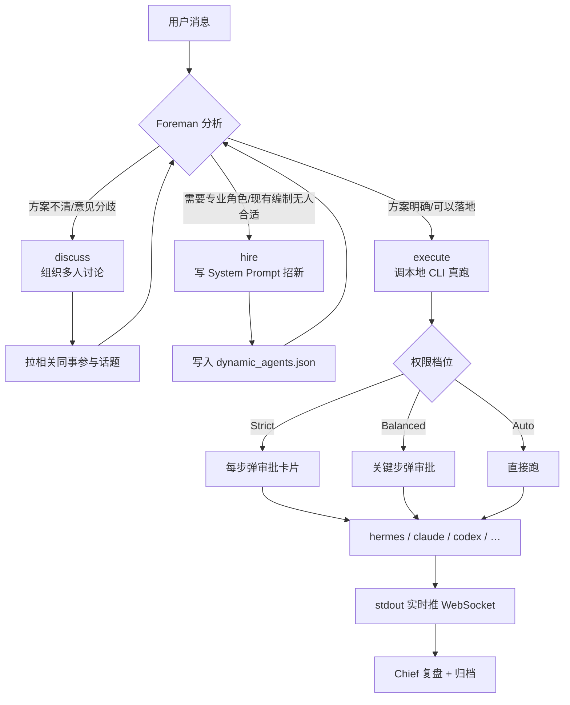

# Crew · 桌面级多 Agent 协作应用

**简体中文** · [English](./README.en.md)

> 一个可以直接双击启动的桌面级多 Agent 协作应用。
> 一位工头（Foreman）+ 一位老板（Chief）+ 11 位职能同事，
> 在同一个原生窗口里完成 *讨论 → 招人 → 分派 → 执行 → 复盘* 的完整闭环。
> 底层由本地 FastAPI + WebSocket 驱动，前端跑在 Microsoft Edge WebView2 里，
> 执行阶段可无缝对接 **Hermes / Claude Code / OpenAI Codex / OpenCode / Aider / Gemini CLI** 等任意本地 Agent。

<p align="left">
  
  
  
  
  
  
  <a href="https://github.com/IFConstantine/crew-multi-agent/releases/latest"></a>
</p>

---

## 📖 目录

- [项目定位](#-项目定位)
- [功能特性](#-功能特性)
- [技术栈](#-技术栈)
- [系统架构](#-系统架构)
- [快速开始](#-快速开始)
- [Agent 团队编制](#-agent-团队编制)
- [工作流：Foreman 如何调度](#-工作流foreman-如何调度)
- [支持的 LLM Provider](#-支持的-llm-provider)
- [支持的本地 Agent CLI](#-支持的本地-agent-cli)
- [权限模型](#-权限模型)
- [目录结构](#-目录结构)
- [数据存储位置](#-数据存储位置)
- [自行打包](#-自行打包)
- [开发指南](#-开发指南)
- [常见问题](#-常见问题)
- [路线图](#-路线图)
- [License](#-license)

---

## 🎯 项目定位

**Crew 不是一个"多角色聊天玩具"，而是一个把 LLM 变成生产力工作台的桌面应用。**

它解决三个真实痛点：

1. **单 Agent 不够用**——真实工作需要产品、开发、设计、测试、法务、财务多角色协作，一个"通用 helper"无法覆盖。
2. **多 Agent 框架都停留在命令行**——LangGraph、CrewAI、AutoGen 这些库工程门槛高，普通用户无法直接用。
3. **Web 版体验不到位**——浏览器 tab、地址栏、书签栏都是干扰；桌面应用应该有自己的窗口、图标、任务栏入口。

Crew 的定位：

- **产品视角**：一个能直接分发给非工程用户的 Windows 桌面应用（`.exe` 双击即用）
- **工程视角**：一个可以自主定制、扩展 Agent、切换 LLM、桥接任意本地 CLI 的开源脚手架
- **交互视角**：以"发布任务给一支团队"为心智模型，而不是"跟一个机器人聊天"

---

## ✨ 功能特性

### 桌面原生体验

- **一次双击直接进入应用窗口**，不弹终端黑窗、无浏览器痕迹
- 使用 [pywebview](https://pywebview.flowrl.com/) + Windows 10/11 内置的 **Edge WebView2** 渲染，安装包 ≈ 20 MB
- 关闭窗口即完全退出，无后台残留
- 独立应用图标、任务栏入口、开始菜单快捷方式、控制面板卸载入口——完全符合桌面软件规范

### 多 Agent 协作

- **11 位常驻同事** + **1 位 Foreman（工头）** + **1 位 Chief（老板）** 共 13 个 Agent
- 每位同事有独立的**头像、职能、语气、System Prompt**
- Foreman 具备三种动作：`discuss`（组织讨论）、`hire`（动态招新）、`execute`（真调本地 CLI 落地）
- **动态招新**：需求超出现有编制时，Foreman 会写一份 System Prompt 招入新同事，持久化到 `dynamic_agents.json`

### LLM Provider 抽象

- **10 家 provider 一键切换**：OpenAI · Anthropic · DeepSeek · Kimi · 智谱 GLM · 火山方舟 · OpenRouter · Groq · 通义千问 · SiliconFlow
- **API key 前缀智能识别**：粘 `sk-ant-*` 直接判定为 Anthropic，粘 `sk-or-*` 判定为 OpenRouter，识别不了时弹下拉手选
- **OpenAI 兼容 + Anthropic Messages** 两种协议同时支持
- 主界面右上角设置面板可随时改 provider / model / key，无需重启

### 本地 Agent CLI 自动识别与切换 ⭐

- **不绑定单一执行器**——Foreman 可以调用系统里任意一款已装的本地 coding agent
- **启动时自动探测**：Hermes、Claude Code、OpenAI Codex、OpenCode、Aider、Gemini CLI 都能被识别
- **用户可在设置面板里手动切换**默认执行器，未安装的项灰掉不可选
- 加新 CLI 只需在 `agents_cli.py` 的 `AGENT_SPECS` 列表里追加一条

### 真实执行能力

- Foreman 决定"要真干"时，调用当前选中的本地 CLI（如 `hermes -z --yolo` / `claude -p` / `codex exec` / `opencode run` / `aider --yes` / `gemini -p`）在本地执行
- 三档权限：**Strict**（每步都问）/ **Balanced**（默认）/ **Auto**（Foreman 全权）
- 完整审批链：每一步 Foreman 意图 → 前端弹卡片 → 用户点批准/驳回 → 记录到 `team.db`

### 本地优先

- 所有数据存 `%APPDATA%\Crew\`：`config.json` / `.env` / `team.db`（SQLite）/ `dynamic_agents.json`
- **对外零监听**：应用只在 `127.0.0.1:8765` 通信，局域网访问不了（需显式改代码开放）
- 卸载不删数据，重装恢复现场

---

## 🧰 技术栈

| 层 | 技术 | 用途 |
|---|---|---|
| **打包** | PyInstaller 6.21（onedir 模式） | 把 Python + 依赖 + 静态资源 → 独立 `crew.exe` |
| **安装器** | Inno Setup 6 | 生成 `Crew-Setup-*.exe`（Windows 标准安装向导 + 卸载入口） |
| **桌面壳** | pywebview 6.2 + Edge WebView2 | 原生窗口，主线程 GUI |
| **后端** | FastAPI 0.115 + Uvicorn | HTTP + WebSocket 双通道 |
| **模型调用** | httpx（异步） | OpenAI 兼容 + Anthropic Messages 双协议 |
| **数据** | SQLite (stdlib `sqlite3`) | 话题 / 消息 / 审批记录 |
| **前端** | 原生 HTML + CSS + JS，无框架 | 保持轻量、启动快、易审计 |
| **中文字体** | LXGW WenKai（Web 加载） | 无衬线楷体 |
| **CLI 桥接** | subprocess → 探测到的任意本地 Agent CLI | 统一在 `agents_cli.py` 抽象 |

**为什么不用 Electron？** Electron 每次都要打包整个 Chromium（~150 MB）；WebView2 用系统已有的 Edge 内核，安装包 20 MB 就能跑，冷启动 < 2 秒。

**为什么不用前端框架？** 项目 UI 就一个窗口 + 一个消息流，React/Vue 的构建链、状态库、打包体积在这个场景是负资产。原生 HTML 直接由 FastAPI 的 `StaticFiles` 挂载，一处改动秒热更。

---

## 🏗 系统架构

```
┌────────────────────────────────────────────────────────────────┐
│                    双击 crew.exe（Windows GUI 程序）              │
│                              │                                  │
│                launcher.py（主进程，PID 唯一）                    │
│              ┌─────────────┼─────────────┐                     │
│              │             │             │                     │
│         [主线程]      [守护子线程]                                │
│              │             │                                    │
│      pywebview.create   uvicorn.run                             │
│         Edge WebView2   FastAPI @ 127.0.0.1:8765                │
│         原生窗口          │                                       │
│              ↕            │                                     │
│         HTTP + WS ────────┤                                     │
│                           │                                     │
│                    ┌──────┴──────┐                              │
│                    │   server.py │                              │
│                    │   (API 层)  │                              │
│                    └──────┬──────┘                              │
│                           │                                     │
│           ┌───────────────┼──────────────┐                      │
│           ↓               ↓              ↓                      │
│    supervisor.py    providers.py    static/index.html          │
│    (Foreman 决策)   (10 家 LLM)     (前端 SPA)                   │
│           │                                                     │
│           ↓                                                     │
│    agents_cli.py（本地 CLI 抽象 + 自动探测）                       │
│           │                                                     │
│           └─→ subprocess → hermes / claude / codex /            │
│                            opencode / aider / gemini            │
│                                                                 │
│  数据落盘：%APPDATA%\Crew\                                       │
│    ├─ config.json          # 用户偏好 + provider + 选中 CLI       │
│    ├─ .env                 # API key（永不上传 GitHub）            │
│    ├─ team.db              # SQLite: 话题/消息/审批                │
│    ├─ dynamic_agents.json  # Foreman 动态招入的同事               │
│    └─ launcher.log         # 启动日志                             │
└────────────────────────────────────────────────────────────────┘
```

### 关键设计约束

- **pywebview 必须跑主线程**（Windows COM 要求），因此 uvicorn 走守护子线程，进程退出即整体退出
- **console=False（Windows GUI subsystem）**，双击不弹 CMD 黑窗；副作用是 `sys.stdout = None`，所有 `print` 走 `_redirect_std_streams` 兜底到日志文件
- **ASSETS_DIR / DATA_DIR 分离**：只读静态资源打进 exe（PyInstaller `_MEIPASS`），可写数据走 `%APPDATA%`，卸载重装不丢历史
- **端口 8765 硬编码**：应用只对本机通信，多开需要改端口分配逻辑

---

## 🚀 快速开始

### 方式一：安装器（推荐）

1. 从 [Releases 页](https://github.com/IFConstantine/crew-multi-agent/releases/latest) 下载最新版 **`Crew-Setup-vX.X.X.exe`**（≈20 MB）
2. 双击运行，走安装向导（可选桌面/开始菜单快捷方式）
3. 完成 → 从桌面或开始菜单启动 Crew
4. 首次运行会弹向导：粘贴任一家 LLM 的 API key → 系统自动识别 provider → 点"好的，开始"

**卸载**：控制面板 → 程序和功能 → 找到 "Crew" → 卸载。用户数据默认保留在 `%APPDATA%\Crew\`，如需彻底清除手动删除该目录。

### 方式二：便携版

1. 下载 **`Crew-vX.X-win64.zip`**（≈22 MB）
2. 解压到任意目录
3. 双击 `crew.exe`

无需管理员权限、无需写注册表，绿色便携。

### 方式三：源码运行

适合开发、调试、自行修改。

```bash
# 1. 克隆
git clone https://github.com/IFConstantine/crew-multi-agent.git
cd crew-multi-agent

# 2. 建虚拟环境（Python 3.11+，推荐 3.13）
python -m venv .venv
.venv\Scripts\activate

# 3. 装依赖
pip install fastapi "uvicorn[standard]" httpx websockets pywebview pillow

# 4. 跑桌面版（原生窗口）
python launcher.py

# 或跑纯 Web 版（浏览器访问 http://127.0.0.1:8765/）
python server.py
```

**前置**：需要 Windows 10/11。Windows 10 早期版本可能缺 WebView2 Runtime，从 [Microsoft 官网](https://developer.microsoft.com/en-us/microsoft-edge/webview2/) 下载 Evergreen 版本即可。

---

## 👥 Agent 团队编制

| 角色 | 英文名 | 定位 | 何时出场 |
|---|---|---|---|
| 老板 | **Chief** | 决策/拍板/复盘 | 战略级问题、验收 |
| 工头 | **Foreman** | 调度/招人/落地执行 | **总是在场**，接收所有任务 |
| 产品 | **Pine** | 需求梳理、PRD、优先级 | 需求不清、方案发散 |
| 开发 | **Ash** | 架构、代码、技术选型 | 实现、调试、性能优化 |
| 设计 | **Wren** | UI/UX、视觉、交互 | 界面、体验、可用性问题 |
| 测试 | **Owl** | 用例、回归、QA | 上线前、Bug 复现 |
| 数据 | **Rune** | 指标、埋点、分析 | 决策要看数、AB 结果 |
| 客服 | **Poppy** | 用户反馈、FAQ | 用户抱怨、售后 |
| 法务 | **Judge** | 合规、条款、隐私 | 涉及用户数据、条款 |
| 运营 | **Rally** | 增长、活动、内容 | 拉新、社区、转化 |
| HR | **Ivy** | 招聘、团建、协作 | 人事、扩编 |
| 财务 | **Ledger** | 预算、成本、报表 | 预算审批、财务分析 |

**每位同事的 System Prompt 定义在 `supervisor.py` 的 `AGENTS` 字典中**，包含：性格、语气、专业能力边界、常用工具偏好。

**动态招新**：如果任务需要一位"游戏策划""生物学专家"，Foreman 会生成一份新 System Prompt 加入 `dynamic_agents.json`，下次自动加载。

---

## 🔄 工作流：Foreman 如何调度

**用户发一条消息 → Foreman 做决策 → 三种动作之一**：



**审批卡片长这样**（前端渲染）：

```
┌────────────────────────────────────────────────┐
│ Foreman 要执行（Claude Code）：                  │
│   命令：claude -p "写个 Python 脚本…"            │
│   预计耗时：30 秒                                 │
│                                                 │
│   [批准]   [驳回]   [看详情]                      │
└────────────────────────────────────────────────┘
```

---

## 🔌 支持的 LLM Provider

| Provider | 默认模型 | API 前缀识别 | 协议 |
|---|---|---|---|
| **火山方舟** (VolcEngine ARK) | `ark-code-latest` | 手选 | OpenAI 兼容 |
| **OpenAI** | `gpt-4o-mini` | `sk-` (共用) | OpenAI 原生 |
| **Anthropic Claude** | `claude-3-5-sonnet-latest` | ✅ `sk-ant-` 唯一 | Anthropic Messages |
| **DeepSeek** | `deepseek-chat` | `sk-` (共用) | OpenAI 兼容 |
| **Kimi** (月之暗面) | `kimi-latest` | `sk-` (共用) | OpenAI 兼容 |
| **智谱 GLM** | `glm-4-flash` | ✅ `hex.hex` 唯一 | OpenAI 兼容 |
| **OpenRouter** | `anthropic/claude-3.5-sonnet` | ✅ `sk-or-` 唯一 | OpenAI 兼容 |
| **Groq** | `llama-3.3-70b-versatile` | ✅ `gsk_` 唯一 | OpenAI 兼容 |
| **通义千问** (阿里) | `qwen-plus` | `sk-` (共用) | OpenAI 兼容 |
| **SiliconFlow** (硅基流动) | `Qwen/Qwen2.5-7B-Instruct` | `sk-` (共用) | OpenAI 兼容 |

**识别策略**：优先看 key 前缀能否唯一定位；共用 `sk-` 前缀的四家（OpenAI/DeepSeek/Kimi/通义）识别不了时，向导会弹下拉让用户手动选择。

**加自己的 provider**：编辑 `providers.py` 中的 `PROVIDERS` 字典即可，5 行代码搞定。

---

## 🤖 支持的本地 Agent CLI

Crew **不绑定单一执行器**——Foreman 可以调用系统里任意一款已装的本地 coding agent。启动时自动探测，用户可在设置面板里切换。

| Agent | 命令 | 调用格式 | 说明 |
|---|---|---|---|
| **Hermes Agent** | `hermes` | `hermes -z "<prompt>" --yolo` | Nous Research 的通用 agent 框架 |
| **Claude Code** | `claude` | `claude -p "<prompt>"` | Anthropic 官方 CLI |
| **OpenAI Codex** | `codex` | `codex exec "<prompt>"` | OpenAI 官方 coding agent |
| **OpenCode** | `opencode` | `opencode run "<prompt>"` | 开源社区 fork |
| **Aider** | `aider` | `aider --message "<prompt>" --yes --no-git` | 老牌 git-aware pair programmer |
| **Gemini CLI** | `gemini` | `gemini -p "<prompt>"` | Google 官方 |

### 自动探测

启动时 `agents_cli.py` 会：

1. 遍历 `AGENT_SPECS` 列表，对每一项调 `shutil.which()` 查系统 PATH
2. 兜底看几个常见"绿色安装"路径（如 `%APPDATA%\npm\` 下的 `.cmd` 快捷方式、Hermes 的 venv 位置）
3. 返回一个 `[{id, name, path, installed, homepage, install_hint}]` 列表

**优先级**：默认选 Hermes；Hermes 没装就按 `AGENT_SPECS` 顺序找第一个装了的。用户在设置面板选过一次后，会记到 `config.json` 的 `local_agent` 字段。

### 手动切换

主界面右上角设置面板 → **本地执行 Agent · Local Executor** 下拉。未安装的项灰掉不可选，安装完重启应用会自动出现在列表里。

### 加一个新 CLI

编辑 `agents_cli.py` 的 `AGENT_SPECS` 列表，追加一条 `AgentSpec`：

```python
AgentSpec(
    id="your-agent",
    name="Your Agent",
    command="your-agent",           # 系统 PATH 里的可执行文件名（不含扩展）
    build_args=lambda prompt: ["--prompt", prompt, "--non-interactive"],
    homepage="https://your-agent.example",
    install_hint="npm install -g @your-org/your-agent",
    extra_probe_paths=[             # 可选：非标准安装位置的兜底路径
        str(Path.home() / "AppData" / "Local" / "your-agent" / "bin" / "your-agent.exe"),
    ],
),
```

重启即生效。

### API 端点

- `GET /api/local-agents` → 探测结果 + 当前选中
- `POST /api/local-agents/select` `{"agent_id": "claude"}` → 切换默认执行器
- `GET /api/config` 里的 `local_agents` / `selected_local_agent` / `local_agent_ready` 字段同样反映探测状态

---

## 🔐 权限模型

三档递进：

| 档位 | Foreman 行为 | 适合场景 |
|---|---|---|
| **Strict** | 每一次 `discuss` / `hire` / `execute` 都弹审批卡片 | 首次使用、涉及生产数据、不熟悉本地 Agent 行为 |
| **Balanced**（默认） | `discuss` 自动通过；`hire` / `execute` 弹审批 | 日常使用 |
| **Auto** | 全部自动通过，Foreman 全权处理 | 长时间批处理、离席运行 |

档位存储在 `%APPDATA%\Crew\config.json` 的 `permission_level` 字段，主界面顶部下拉框实时切换。

---

## 📁 目录结构

```
crew-multi-agent/
├─ launcher.py              # 入口：pywebview 窗口 + uvicorn 子线程
├─ server.py                # FastAPI 应用 + 路由 + WebSocket 广播
├─ supervisor.py            # Foreman 大脑 + 11 位 Agent 定义
├─ providers.py             # 10 家 LLM 抽象 + 自动识别
├─ agents_cli.py            # 本地 Agent CLI 抽象 + 探测（Hermes/Claude/Codex/…）
├─ gen_icon.py              # 生成 static/crew.ico（7 尺寸多帧）
├─ gen_avatars.py           # 生成 static/avatars/*.svg（DiceBear 固化）
│
├─ crew.spec                # PyInstaller 打包脚本
├─ crew.iss                 # Inno Setup 安装器脚本
├─ install.py / install.bat # 首次源码安装向导（可选）
│
├─ static/                  # 前端资源（打进 exe 只读）
│  ├─ index.html            # 单文件 SPA（HTML+CSS+JS）
│  ├─ crew.ico              # 应用图标（7 尺寸）
│  ├─ crew.png              # 256×256 预览
│  └─ avatars/*.svg         # 12 个 Agent 头像
│
├─ dist_extras/             # 分发用附加文件
│  └─ README.md             # 打包后用户看的说明
│
├─ 打开作战室.bat            # 源码模式快捷启动（Windows）
├─ 停止作战室.bat            # 关闭所有 crew.exe
├─ start_hidden.vbs         # 无窗口启动（可放启动项）
│
├─ .env.example             # API key 示例
├─ .gitignore
├─ README.md                # 你正在读的这份（中文）
├─ README.en.md             # 英文版
└─ LICENSE
```

---

## 💾 数据存储位置

**所有可写数据都在 `%APPDATA%\Crew\`**（即 `C:\Users\<你>\AppData\Roaming\Crew\`）：

| 文件 | 用途 | 卸载后 |
|---|---|---|
| `config.json` | 用户偏好（provider、model、权限档、选中的本地 Agent、onboard 状态） | 保留 |
| `.env` | API key（明文） | 保留 |
| `team.db` | SQLite：话题、消息、审批记录 | 保留 |
| `dynamic_agents.json` | Foreman 动态招入的同事 System Prompt | 保留 |
| `launcher.log` | 启动日志 | 保留 |
| `server.log` | 后端日志 | 保留 |
| `launcher_crash.log` | 崩溃堆栈（如有） | 保留 |

**为什么保留？** 卸载重装不丢历史。想彻底清除：`rmdir /s "%APPDATA%\Crew"`。

---

## 📦 自行打包

### 依赖工具

```bash
pip install pyinstaller
```

外加 [Inno Setup 6](https://jrsoftware.org/isdl.php)（免费，装到默认位置即可）。

### 三步走

```bash
# 1. 生成图标（可选，仓库已带 static/crew.ico）
python gen_icon.py

# 2. PyInstaller 出 crew.exe + 依赖目录
pyinstaller crew.spec --noconfirm --clean
# → dist/Crew/crew.exe (≈10 MB)
# → dist/Crew/_internal/ (≈25 MB, 含 Python runtime + 所有 .pyd)

# 3. Inno Setup 出安装器
"C:/Users/<你>/AppData/Local/Programs/Inno Setup 6/ISCC.exe" crew.iss
# → dist/Crew-Setup-vX.X.X.exe (≈20 MB)
```

### 打包关键点

- **PyInstaller 用 `onedir` 不用 `onefile`**：启动快 3-5 倍，便于 Inno Setup 增量更新
- **`console=False`**：Windows GUI subsystem，双击不弹 CMD
- **必须 `collect_all('pydantic_core')`**：pydantic v2 的 C 扩展 `.pyd` 靠 hidden import 抓不到
- **必须 `collect_all('webview')` `collect_all('clr_loader')` `collect_all('pythonnet')`**：pywebview 依赖 .NET 绑定
- **图标嵌入**：`crew.spec` 里 `exe = EXE(..., icon="static/crew.ico")`，通过 `pefile` 可以验证 exe 里有 7 个 `RT_ICON` 资源

---

## 🛠 开发指南

### 加一位新 Agent

编辑 `supervisor.py` 中 `AGENTS` 字典：

```python
AGENTS = {
    ...
    "Sage": {
        "role_zh": "顾问",
        "avatar": "static/avatars/Sage.svg",
        "system_prompt": (
            "你叫 Sage，一位资深战略顾问。语气沉稳、逻辑严密、"
            "习惯用 3 点式结论表达观点。回答控制在 200 字以内。"
        ),
        "temperature": 0.6,
    },
}
```

放一个 `static/avatars/Sage.svg`（去 [DiceBear](https://www.dicebear.com/9.x/pixel-art/svg?seed=Sage) 拉即可），重启即生效。

### 加一家 LLM Provider

编辑 `providers.py` 中 `PROVIDERS` 字典，见 [支持的 LLM Provider](#-支持的-llm-provider) 一节的样例。

### 加一款本地 Agent CLI

编辑 `agents_cli.py` 的 `AGENT_SPECS` 列表，见 [支持的本地 Agent CLI](#-支持的本地-agent-cli) 一节的样例。

### 修改 UI

`static/index.html` 是**单文件 SPA**（HTML+CSS+JS 全在里面，无构建步骤）。

改完保存 → 桌面窗口按 `Ctrl+R`（或右键 → 重新加载）即可看到效果，无需重启后端。

### 调试模式

`launcher.py` 里把 `webview.start(gui=None, debug=False)` 的 `debug` 改成 `True`，桌面窗口右键会出现"检查"选项（DevTools）。

后端日志：源码模式默认打 stdout；打包版默认写到 `%APPDATA%\Crew\launcher.log`。

---

## ❓ 常见问题

**Q：Windows Defender 弹"未知发行者"警告？**
A：正常。安装包未做代码签名（个人开发者证书 ¥3000/年，暂缓）。点"更多信息 → 仍要运行"即可。想彻底消除警告需要购买 EV 代码签名证书。

**Q：双击图标没反应？**
A：查看 `%APPDATA%\Crew\launcher.log` 和 `launcher_crash.log`。最常见原因是 WebView2 Runtime 缺失（Win 10 老版本），从微软官网下载安装 Evergreen 版即可。

**Q：能局域网访问吗？**
A：默认不能，`launcher.py` 里 `host="127.0.0.1"`。改成 `"0.0.0.0"` 并加上你自己的鉴权层后可以，但**不建议**直接暴露到公网。

**Q：能跑在 macOS / Linux 吗？**
A：**当前只支持 Windows**。pywebview 在 macOS 用 WKWebView、Linux 用 GTK WebKit 理论上都能跑，但没测过，图标 / 安装器 / 数据路径都需要适配。欢迎 PR。

**Q：一个本地 Agent CLI 都没装，能跑吗？**
A：能。所有 discuss / hire 流程完全不依赖本地 CLI；只有当 Foreman 决定 `execute` 时才会去调。此时会返回一段"未装 Agent"的提示 + 各家安装命令。

**Q：安装包是 20 MB，为什么解压后有 35 MB？**
A：Inno Setup 用 LZMA2 压缩，解压后是原始文件。其中 `_internal/` 里主要是 Python 3.13 runtime（≈15 MB）+ pydantic_core `.pyd`（≈2 MB）+ WebView2 桥接 DLL（≈5 MB）+ FastAPI/uvicorn/httpx（≈3 MB）。

**Q：可以只用一家 LLM 吗？**
A：可以。向导里填一家的 key 即可，其他家不用管。后续想加只需右上角设置 → 切换 provider → 填新 key。

---

## 🗺 路线图

- [x] v1.0 - Web 版原型（本地浏览器）
- [x] v1.1 - 10 家 LLM 抽象 + 自动识别
- [x] v1.2 - pywebview 桌面窗口 + 无黑窗
- [x] v1.3 - 自研图标 + Inno Setup 安装器
- [x] v1.4 - **多本地 Agent CLI 支持**（Hermes / Claude Code / Codex / OpenCode / Aider / Gemini 自动探测与切换）
- [ ] v1.5 - **托盘图标 + 后台常驻**（关窗最小化到托盘）
- [ ] v1.6 - **多会话/多项目**（同时开多个 workspace）
- [ ] v1.7 - **导出/分享**（把一次 discuss 导成 Markdown/PDF）
- [ ] v1.8 - **macOS 版本**（pywebview + WKWebView）
- [ ] v2.0 - **插件系统**（第三方可注册新 Agent、新 Provider、新执行器）

---

## 📄 License

[MIT](./LICENSE)

---

## 🙏 致谢

- 桌面壳：[pywebview](https://pywebview.flowrl.com/)
- 后端：[FastAPI](https://fastapi.tiangolo.com/) · [Uvicorn](https://www.uvicorn.org/)
- 打包：[PyInstaller](https://pyinstaller.org/) · [Inno Setup](https://jrsoftware.org/isinfo.php)
- 中文字体：[LXGW WenKai](https://github.com/lxgw/LxgwWenKai)
- 头像素材：[DiceBear](https://www.dicebear.com/) pixel-art style
- 本地 CLI 生态：Hermes · Claude Code · OpenAI Codex · OpenCode · Aider · Gemini CLI
- LLM API：火山方舟 · OpenAI · Anthropic · DeepSeek · 月之暗面 · 智谱 · OpenRouter · Groq · 阿里通义 · 硅基流动

---

<sub>Built by <a href="https://github.com/IFConstantine">IFConstantine</a> · <a href="./README.en.md">English</a></sub>
